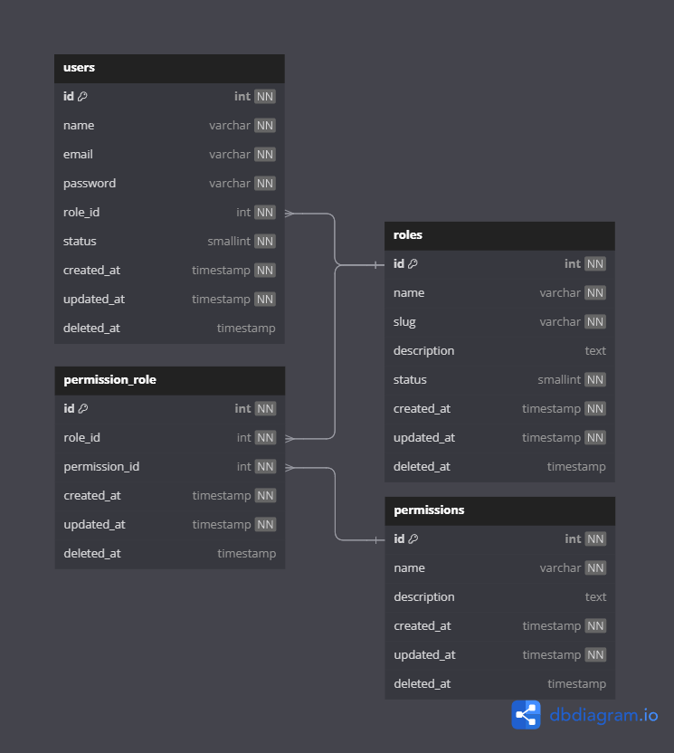

# Desafio GS3

> Desafio proposto para a vaga de desenvolvedor fullstak sênior

## Qual é o Desafio?

> Criar um sistema que gerencie usuários e perfis de acesso.

## Requisitos

- PHP ^8.1
- Laravel ^11.0
- Composer ^2.0
- pgSQL
- Git
- Docker

## Como subir o ambiente

> Clone o repositório no link:

- Com o projeto clonado, abra o terminal e vá até a pasta do projeto e rode o seguinte comando:


- Para utilizar o Laravel Sail

````
docker run --rm \
    -u "$(id -u):$(id -g)" \
    -v "$(pwd):/var/www/html" \
    -w /var/www/html \
    laravelsail/php83-composer:latest \
    composer install --ignore-platform-reqs
````


- Após isso, copie o .env.example para .env e configure:

````
cp .env.example .env
````

- Configure as credenciais do banco de dados:

````
DB_CONNECTION=pgsql
DB_HOST=pgsql
DB_PORT=5432
DB_DATABASE=laravel
DB_USERNAME=sail
DB_PASSWORD=password
````

- Suba o ambiente docker, usando o seguinte comando:

````
sail up -d ou ./vendor/sail up -d
````

- Gere a chave APP_KEY

````
sail art key:generate ou sail artisan key:generate
````

- Após isso, rode a migration e o seeder

````
sail art migrate --seed ou sail artisan migrate --seed

ou

sail art migrate ou sail artisan migrate
sail art db:seed ou sail artisan db:seed
````

- Após o banco criado e populado, rode o npm:

````
sail npm install && npm run dev
````

- Ou se preferir gerar o build do frontend:

````
sail npm run build
````

- Acesse no navegador o "http://localhost" e acesse a aplicação, com a seguinte credencial:

````
login: admin@email.com
password: secret
````

- Para acessar o painel de e-mails, abra o link: http://localhost:8025

## Modelagem do Banco de dados

> Link: https://dbdiagram.io/d/GS3Challenge-66980bf88b4bb5230e9edde2

> Link: https://dbdocs.io/huriellopes1996/GS3Challenge


